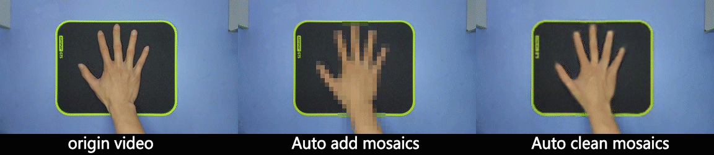
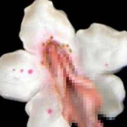
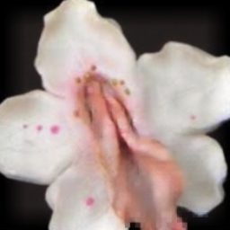
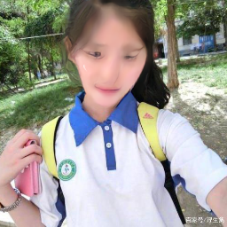
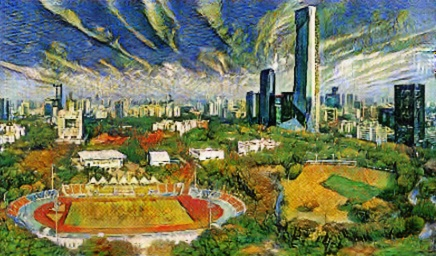
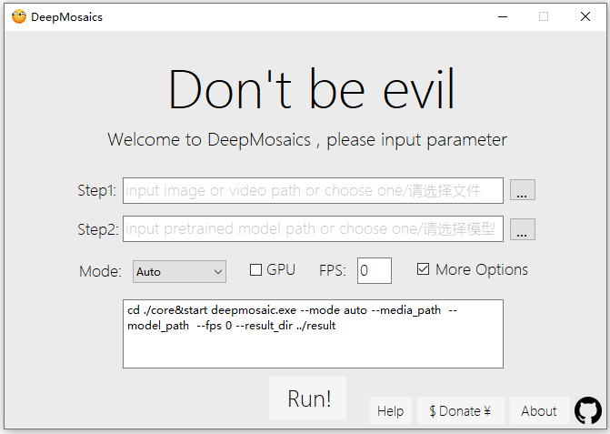

<div align="center">
  <br><br>
  &emsp;&emsp;<a href="https://github.com/HypoX64/DeepMosaics/releases"></a>&emsp;<a href="https://github.com/HypoX64/DeepMosaics/releases"></a>&emsp;
</div>

# DeepMosaics
**[English](./README.md) | 中文**<br>

这是一个通过深度学习自动的为图片/视频添加马赛克,或消除马赛克的项目.<br>它基于“语义分割”以及“图像翻译”.<br>现在可以在这个[网站](http://118.89.27.46:5000/)尝试使用该项目清除马赛克!<br>

### 例子


原始 | 自动打码 |  自动去码  
:-:|:-:|:-:
 |  |  
  |  |  

* 与 [DeepCreamPy](https://github.com/deeppomf/DeepCreamPy)相比较

马赛克图片 | DeepCreamPy | ours  
:-:|:-:|:-:
 |  |  
 |  |  

* 风格转换

原始 | 梵高风格 | 转化为冬天
:-:|:-:|:-:
 |  |  

一个有意思的尝试:[香蕉君♂猫](https://www.bilibili.com/video/BV1Q7411W7n6)

## 如何运行
可以通过我们预编译好的二进制包或源代码运行.<br>
### 在网页中运行
打开[这个网站](http://118.89.27.46:5000/)上传照片，将获得去除马赛克后的结果，受限于当地法律，**目前只支持人脸**.<br>
### 预编译的程序包
对于Windows用户,我们提供了包含GUI界面的免安装软件包.<br>
可以通过下面两种方式进行下载: [[Google Drive]](https://drive.google.com/open?id=1LTERcN33McoiztYEwBxMuRjjgxh4DEPs)  [[百度云,提取码1x0a]](https://pan.baidu.com/s/10rN3U3zd5TmfGpO_PEShqQ) <br>

* [[帮助文档]](./docs/exe_help_CN.md)<br>
* [[视频教程]](https://www.bilibili.com/video/BV1QK4y1a7Av)<br>
<br>

注意事项:<br>
  - 程序的运行要求在64位Windows操作系统,我仅在Windows10运行过,其他版本暂未经过测试<br>
  - 请根据需求选择合适的预训练模型进行测试，不同的预期训练模型具有不同的效果.[[预训练模型介绍]](./docs/pre-trained_models_introduction_CN.md)<br>
  - 运行时间取决于电脑性能,对于视频文件,我们建议在GPU上运行.<br>
  - 如果输出的视频无法播放,这边建议您尝试[potplayer](https://daumpotplayer.com/download/).<br>
  - 相比于源码,该版本的更新将会延后.

### 通过源代码运行
#### 前提要求
  - Linux, Mac OS, Windows
  - Python 3.6+
  - [ffmpeg 3.4.6](http://ffmpeg.org/)
  - [Pytorch 1.0+](https://pytorch.org/) 
  - CPU or NVIDIA GPU + CUDA CuDNN<br>
#### Python依赖项
代码依赖于opencv-python以及 torchvision,可以通过pip install 进行安装.
#### 克隆源代码
```bash
git clone https://github.com/HypoX64/DeepMosaics.git
cd DeepMosaics
```
#### 下载预训练模型
可以通过以下两种方法下载预训练模型,并将他们置于'./pretrained_models'文件夹中.<br>
[[Google Drive]](https://drive.google.com/open?id=1LTERcN33McoiztYEwBxMuRjjgxh4DEPs)  [[百度云,提取码1x0a]](https://pan.baidu.com/s/10rN3U3zd5TmfGpO_PEShqQ) <br>
[[预训练模型介绍]](./docs/pre-trained_models_introduction_CN.md)<br>

#### 简单的例子
* 为视频或照片添加马赛克,例子中认为脸是需要打码的区域 ,可以通过切换预训练模型切换自动打码区域(输出结果将储存到 './result')<br>
```bash
python deepmosaic.py --media_path ./imgs/ruoruo.jpg --model_path ./pretrained_models/mosaic/add_face.pth --gpu_id 0
```
* 将视频或照片中的马赛克移除,对于不同的打码物体需要使用对应的预训练模型进行马赛克消除(输出结果将储存到  './result')<br>
```bash
python deepmosaic.py --media_path ./result/ruoruo_add.jpg --model_path ./pretrained_models/mosaic/clean_face_HD.pth --gpu_id 0
```
#### 更多的参数
如果想要测试其他的图片或视频,请参照以下文件输入参数.<br>
[[options_introduction_CN.md]](./docs/options_introduction_CN.md) <br>

## 使用自己的数据训练模型
如果需要使用自己的数据训练模型，请参照 [training_with_your_own_dataset.md](./docs/training_with_your_own_dataset.md)

## 鸣谢
代码大量的参考了以下项目:[[pytorch-CycleGAN-and-pix2pix]](https://github.com/junyanz/pytorch-CycleGAN-and-pix2pix) [[Pytorch-UNet]](https://github.com/milesial/Pytorch-UNet) [[pix2pixHD]](https://github.com/NVIDIA/pix2pixHD) [[BiSeNet]](https://github.com/ooooverflow/BiSeNet) [[DFDNet]](https://github.com/csxmli2016/DFDNet) [[GFRNet_pytorch_new]](https://github.com/sonack/GFRNet_pytorch_new).

