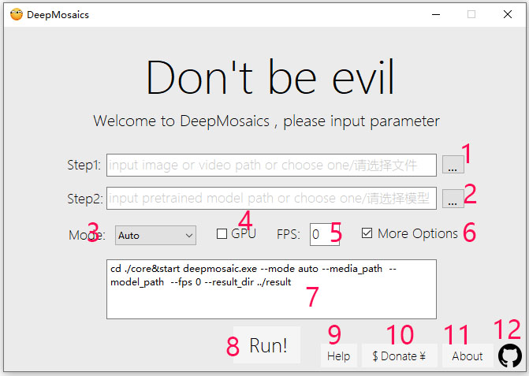

## DeepMosaics.exe  Instructions
**[[中文版]](./exe_help_CN.md)**
This is a GUI version compiled in Windows. 
Download this version and pre-trained model via [[Google Drive]](https://drive.google.com/open?id=1LTERcN33McoiztYEwBxMuRjjgxh4DEPs)  [[百度云,提取码1x0a]](https://pan.baidu.com/s/10rN3U3zd5TmfGpO_PEShqQ)  
Video tutorial => [[youtube]](https://www.youtube.com/watch?v=1kEmYawJ_vk) [[bilibili]](https://www.bilibili.com/video/BV1QK4y1a7Av) 

Attentions: 

  - Require Windows_x86_64, Windows10 is better. 
  - Different pre-trained models are suitable for different effects. 
  - Run time depends on computer performance. 
  - If output video cannot be played, you can try with [potplayer](https://daumpotplayer.com/download/). 
  - GUI version update slower than source. 

### How to install
#### CPU version
* 1.Download and install Microsoft Visual C++
  https://aka.ms/vs/16/release/vc_redist.x64.exe
#### GPU version
Only suppport NVidia GPU above gtx1060(Driver:above 460 & CUDA:11.0)
* 1.Download and install Microsoft Visual C++
  https://aka.ms/vs/16/release/vc_redist.x64.exe
* 2.Update your gpu drive to 460(or above)
  https://www.nvidia.com/en-us/geforce/drivers/
* 3.Download and install CUDA 11.0:
  https://developer.nvidia.com/cuda-toolkit-archive

You can also download them on BaiduNetdisk
https://pan.baidu.com/s/10rN3U3zd5TmfGpO_PEShqQ
Password: 1x0a

### How to use
* step 1: Choose image or video.
* step 2: Choose model(Different pre-trained models are suitable for different effects)
* step 3: Run program and wait.
* step 4: Cheek reult in './result'.

### Introduction to pre-trained models
* Mosaic

|               Name               |                         Description                         |
| :------------------------------: | :---------------------------------------------------------: |
|           add_face.pth           |          Add mosaic to all faces in images/videos.          |
|        clean_face_HD.pth         | Clean mosaic to all faces in images/video. (RAM > 8GB).  |
|         add_youknow.pth          |      Add mosaic to ... in images/videos.      |
| clean_youknow_resnet_9blocks.pth |     Clean mosaic to ... in images/videos.     |
|     clean_youknow_video.pth      |        Clean mosaic to ... in videos. It is better for processing video mosaics         |

*  Style Transfer

|          Name           |                        Description                        |
| :---------------------: | :-------------------------------------------------------: |
| style_apple2orange.pth  | Convert apples to oranges. |
| style_orange2apple.pth  | Convert oranges to apples |
| style_summer2winter.pth |     Convert summer to winter.     |
| style_winter2summer.pth | Convert winter to summer. |
|    style_cezanne.pth    |            Convert photos/video to Paul Cézanne style.            |
|     style_monet.pth     | Convert photos/video to Claude Monet style. |
|     style_ukiyoe.pth     | Convert photos/video to Ukiyoe style. |
|     style_vangogh.pth     | Convert photos/video to Van Gogh style. |
### Annotation
 
* 1. Choose image or video.
* 2. Choose model(Different pre-trained models are suitable for different effects).
* 3. Program running mode.   (auto | add | clean | style)
* 4. Use GPU to run deep learning model. (The current version does not support gpu, if you need to use gpu please run source).
* 5. Limit the fps of the output video(0->original fps).
* 6. More options.
* 7. More options can be input.
* 8. Run program.
* 9. Open help file.
* 10. Sponsor our project.
* 11. Version information.
* 12. Open the URL on github.

### Introduction to options
If you need more effects,  use '--option your-parameters' to enter what you need.
* Base

|    Option    |                Description                 |                 Default                 |
| :----------: | :----------------------------------------: | :-------------------------------------: |
|  --gpu_id   |           if -1, do not use gpu            |                    0                    |
| --media_path |         your videos or images path         |            ./imgs/ruoruo.jpg            |
|    --mode    | program running mode(auto/clean/add/style) |                 'auto'                  |
| --model_path |           pretrained model path            | ./pretrained_models/mosaic/add_face.pth |
| --result_dir |      output media will be saved here       |                ./result                 |
|    --fps     |     read and output fps, if 0-> origin     |                    0                    |

* AddMosaic

|      Option      |                         Description                          | Default  |
| :--------------: | :----------------------------------------------------------: | :------: |
|   --mosaic_mod   | type of mosaic -> squa_avg/ squa_random/ squa_avg_circle_edge/ rect_avg/random | squa_avg |
|  --mosaic_size   |                mosaic size,if 0 -> auto size                 |    0     |
|  --mask_extend   |                      extend mosaic area                      |    10    |
| --mask_threshold |         threshold of recognize mosaic position 0~255         |    64    |

* CleanMosaic

|    Option     |                         Description                          | Default |
| :-----------: | :----------------------------------------------------------: | :-----: |
| --traditional | if specified, use traditional image processing methods to clean mosaic |         |
|   --tr_blur   | ksize of blur when using traditional method, it will affect final quality |   10    |
|   --tr_down   | downsample when using traditional method,it will affect final quality |   10    |
| --medfilt_num |        medfilt window of mosaic movement in the video        |   11    |

* Style Transfer

|    Option     |             Description              | Default |
| :-----------: | :----------------------------------: | :-----: |
| --output_size | size of output media, if 0 -> origin |   512   |